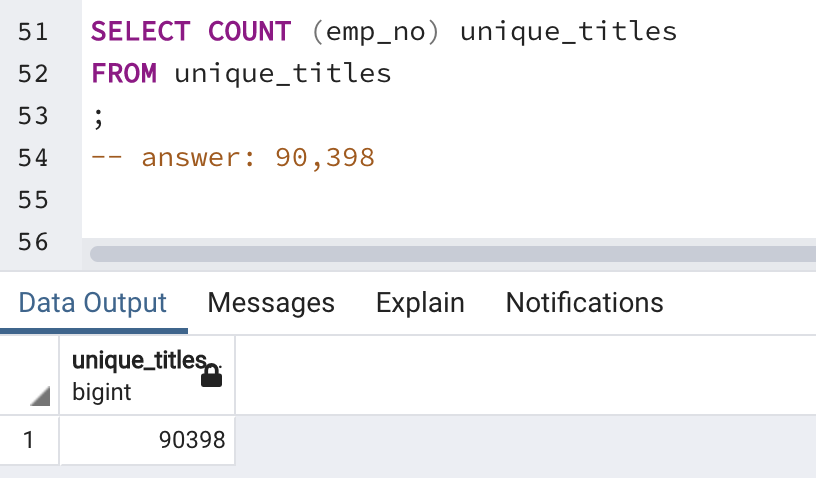
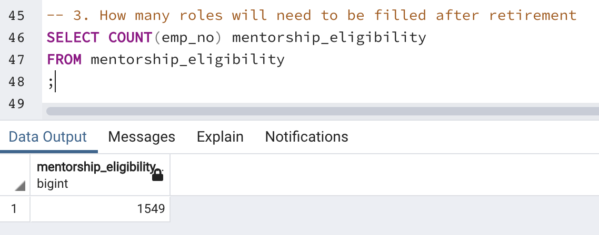

# Pewlett Hackard Analysis Deliverable 3

## 1. Overview 
The purpose of this analysis was to evaluate which positions will need to be filled in the near fiture at Pewlett Hackard. HR hopes to get ahead of job openings due to upcoming retirements. They're hoping to understand who will be retiring and how many positions will need to be filled.

## 2. Results
The number of roles at Pewlett Hackard that will need to be filled by the "silver tsunami" generation retires is 90,398. This can be seen with the query below:

This was done by querying the COUNT from the unique_titles table. 

The next question was to avoid an issue like this from causing workflow disturbances in the future, are there enough qualified, retirement-ready employees to mentor the next generation of PH employees? The answer to that can be seen below:

Running a COUNT of the mentorship_eligibility table, we see that there are only 1,549 employees qualified to mentor the next generation of PH employees. This leaves a large number of open positions for PH.  
